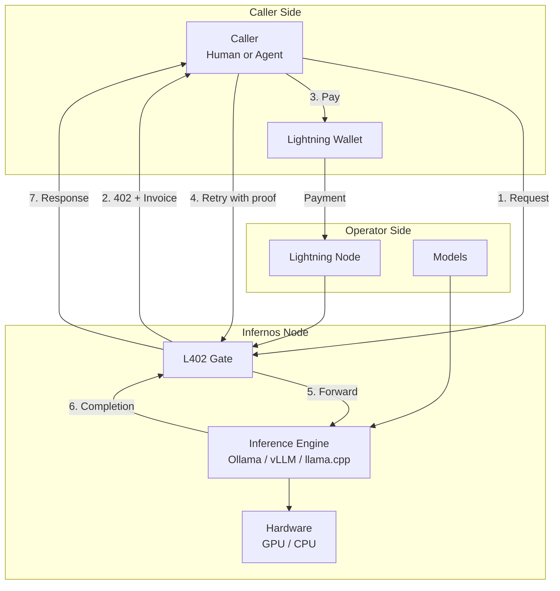

# Infernos

**Permissionless Open-Model Inference Paid in Sats**

[](https://github.com/infernos-ai/infernos/actions/workflows/ci.yml)
[](https://opensource.org/licenses/MIT)

Infernos turns any machine running open-weight AI models into a self-sovereign, paid inference endpoint. Anyone can operate an Infernos node to monetize compute in Satoshis. Any autonomous agent or user can consume inference securely without accounts, subscriptions, API keys, or identity disclosures using cryptographic L402 payment authorization.

---

## Key Features

- **Self-Sovereign Operator Nodes**: Run open-weight models on your own hardware via Ollama or any OpenAI-compatible engine.
- **Permissionless L402 Payments**: Access inference on a per-request or per-token basis authenticated via Lightning Network preimages and macaroons.
- **Session Budgets**: Strict, enforceable expenditure limits for multi-step agent workflows.
- **Privacy by Default**: Zero prompt logging. Prompts and completions are never persisted or exposed in logs.
- **OpenAI-Compatible Surface**: Seamless drop-in compatibility with standard tooling, SDKs, and autonomous agent frameworks.

---

## Architecture Overview



---

## Quick Start

### 1. Build and Setup

```bash
# Clone the repository
git clone git@github.com:infernos-ai/infernos.git
cd infernos-ai

# Build the release binary
cargo build --release
```

---

### 2. Running as an Operator (Node)

Turn your machine running local open-weights into a paid inference endpoint.

#### Step A: Configure Node
Copy the example configuration:
```bash
cp config/node.example.toml config/node.toml
```
Configure your upstream inference runtime (`http://127.0.0.1:11434` for Ollama), model pricing in sats, and your Lightning backend (`mock` for local dev/testing, `lnd`, or `nwc`).

#### Step B: Start the Node
```bash
# Start via CLI
cargo run -- node start --config config/node.toml

# Or using the built release binary
./target/release/infernos node start --config config/node.toml
```

#### Step C: Manage Node Operator Lifecycle
```bash
# Check node earnings, active sessions, and served models
cargo run -- node status

# Gracefully stop the running node
cargo run -- node stop
```

#### Option: Run with Docker Compose
To run both the Infernos Node and an Ollama instance together:
```bash
docker compose -f docker/docker-compose.yml up
```

---

### 3. Using as a Caller / Autonomous Agent

Consume inference without creating accounts or acquiring centralized API keys.

#### Method A: Command-Line Interface (CLI)

```bash
# Query an Infernos node (defaults to --node http://127.0.0.1:8080)
cargo run -- call \
  --node http://127.0.0.1:8080 \
  --model llama3.2 \
  --prompt "Explain the Lightning Network"

# Query with custom session budget (e.g. 500 Sats)
cargo run -- call \
  --node http://127.0.0.1:8080 \
  --model llama3.2 \
  --budget 500 \
  --prompt "Explain Bitcoin L402 in one sentence"
```

#### Method B: Rust SDK / Agent Integration

Embed Infernos directly into your autonomous agents:

```rust
use infernos::client::InfernosClient;

#[tokio::main]
async fn main() -> Result<(), Box<dyn std::error::Error>> {
    // Initialize client pointing to any Infernos node
    let client = InfernosClient::new("http://127.0.0.1:8080")
        .with_budget(500); // Strict session budget in satoshis

    // Automatically negotiates L402 challenge, settles invoice, and returns completion
    let response = client
        .chat("Explain the difference between L402 and API keys.")
        .await?;

    println!("Agent response:\n{}", response);
    Ok(())
}
```

#### Method C: OpenAI-Compatible HTTP Endpoint

Infernos exposes standard OpenAI-compatible endpoints:
- `POST /v1/chat/completions` (L402-gated)
- `GET /v1/models` (Model capabilities & per-model pricing in sats)
- `GET /health` (Node health status)

Any existing agent framework (LangChain, AutoGen, CrewAI, or official OpenAI SDKs) can consume Infernos by handling standard HTTP 402 payment challenges or using an L402 proxy.

---

## Documentation

- [Architecture & System Design](docs/architecture.md)
- [Operator Guide](docs/node-guide.md)
- [Caller & Agent Guide](docs/caller-guide.md)
- [L402 & Payment Protocol](docs/l402-and-payments.md)
- [Session Budgets](docs/session-budgets.md)
- [Privacy Model & Guarantees](docs/privacy.md)
- [Development & Contributing](docs/development.md)

---

## Team

- **Muhammad Hamza**
  - Email: [hamza.00dev1@gmail.com](mailto:hamza.00dev1@gmail.com)
  - GitHub: [@Hamza1610](https://github.com/Hamza1610)
  - LinkedIn: [Muhammad Hamza](https://www.linkedin.com/in/muhammad-hamza-7239b9237/)

- **Usman Umar Garba**
  - Email: [ugarba202@gmail.com](mailto:ugarba202@gmail.com)
  - GitHub: [@Ugarba202](https://github.com/Ugarba202)
  - LinkedIn: [Usman Umar Garba](https://www.linkedin.com/in/usman-umar-garba/)

- **Mubarak Abdullateef**
  - GitHub: [@TechLateef](https://github.com/TechLateef)
  - LinkedIn: [Mubarak Abdullateef](https://www.linkedin.com/in/mubarak-abdullateef/)

---

## License

Licensed under the MIT License ([LICENSE](LICENSE)).
