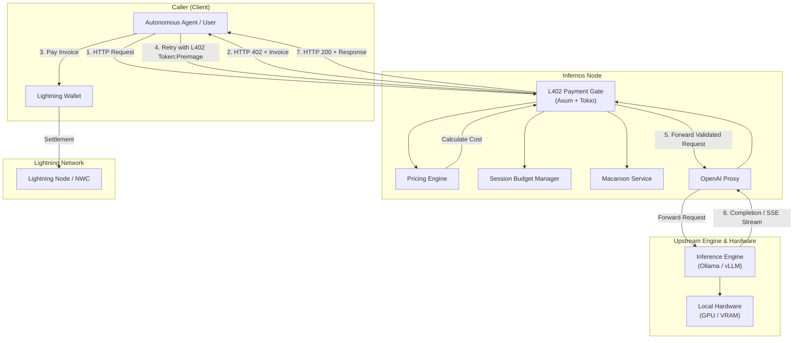
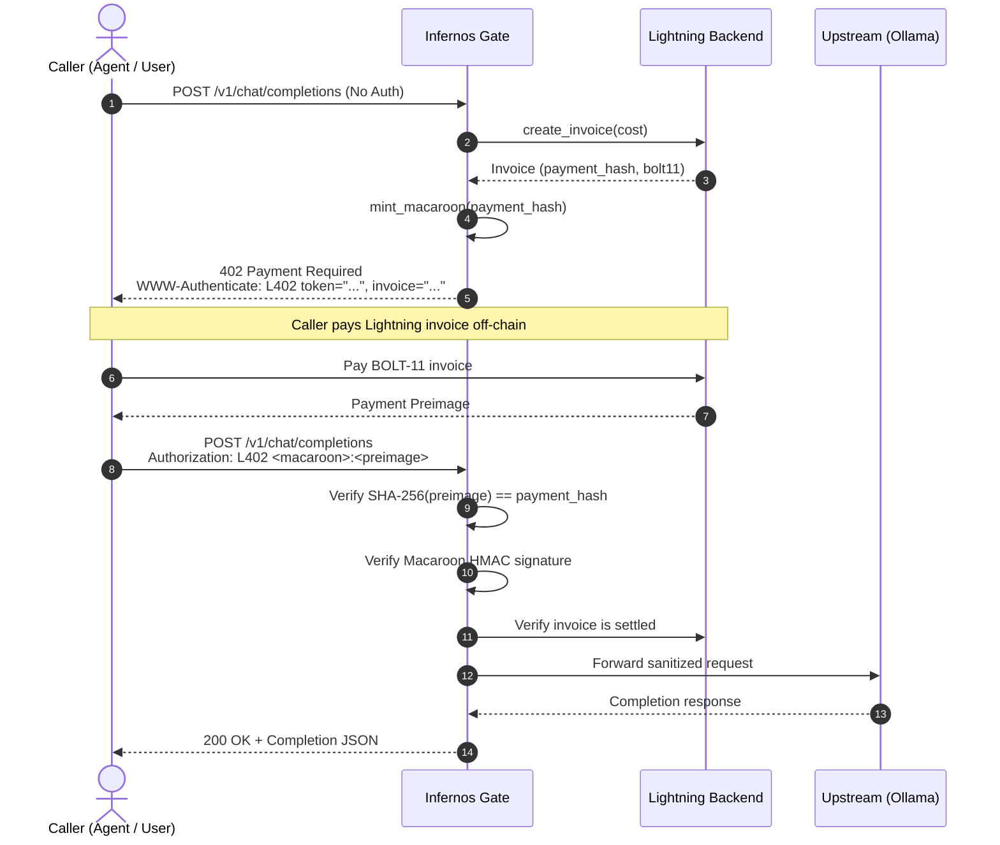
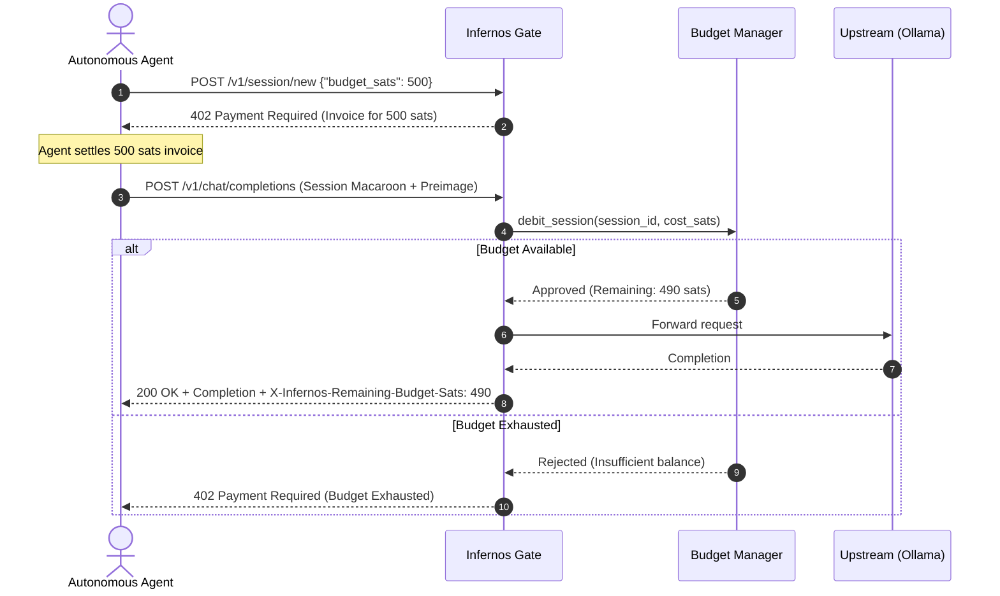

# Infernos Architecture & System Design

**Permissionless Open-Model Inference Paid in Sats via L402**  
Machine Money Track · BOSS Battle 2026

---

## 1. System Overview

Infernos turns any machine running open-weight AI models into a self-sovereign, paid inference endpoint. It sits as a lightweight, auditable reverse proxy and payment gate directly in front of an OpenAI-compatible inference engine (such as Ollama, vLLM, or llama.cpp).

---

## 2. Core Components

### 2.1 L402 Payment Gate (`src/node/gate/`)
The Gate intercepts incoming HTTP requests to protected endpoints (`/v1/chat/completions`) and enforces standard L402 payment validation:
- **`challenge.rs`**: Generates and parses standard HTTP `402 Payment Required` headers:
  `WWW-Authenticate: L402 token="<macaroon>", invoice="<bolt11>"`
- **`macaroon.rs`**: Issues and verifies HMAC-SHA256 cryptographically chained macaroons with optional caveats (`time`, `model`, `session`, `budget`).
- **`verify.rs`**: Parses `Authorization: L402 <macaroon>:<preimage>` headers, verifies `SHA-256(preimage) == payment_hash`, checks backend settlement, and validates caveats.
- **`budget.rs`**: Thread-safe, in-memory session balance manager (`SessionBudgetManager`) enforcing atomic CAS balance debits and exhaustion checks.

### 2.2 Pricing Engine (`src/node/pricing.rs`)
Calculates inference invoice costs dynamically:
- Base flat rate per request (`default_price_sats` / `sats_per_request`).
- Per-token pricing (`sats_per_prompt_token`, `sats_per_completion_token`).
- Built-in heuristic token estimator for OpenAI chat completion payloads.

### 2.3 OpenAI Proxy (`src/node/proxy/`)
- Interacts with upstream inference engines (e.g. `http://127.0.0.1:11434`).
- Supports both standard JSON request/response forwarding and real-time Server-Sent Events (SSE) streaming (`stream: true`).
- Performs dynamic upstream model discovery (`GET /v1/models`) with fallback to configured default models.

### 2.4 Lightning Backend Abstraction (`src/node/lightning/`)
- Defines an asynchronous `LightningBackend` trait:
  - `create_invoice(amount: Satoshis, description: &str) -> Result<Invoice>`
  - `is_invoice_settled(payment_hash: &PaymentHash) -> Result<bool>`
  - `pay_invoice(bolt11: &str) -> Result<Preimage>`
- Ships with an in-memory `MockLightningBackend` for deterministic, zero-network local development and automated testing.
- Extensible to LND gRPC and Nostr Wallet Connect (NWC).

---

## 3. End-to-End Sequence Flows

### 3.1 Direct Pay-per-Request Flow

### 3.2 Pre-Funded Session Budget Flow

---

## 4. Design & Security Principles

1. **Self-Sovereign**: Node operators control their hardware and earn Sats directly.
2. **Permissionless**: No accounts, usernames, credit cards, or centralized API keys.
3. **Privacy by Default**: Zero prompt logging. Prompts and completions are processed in memory and never written to disk or logs.
4. **Economic Safety**: Session budget caveats strictly constrain agent spending limits.
