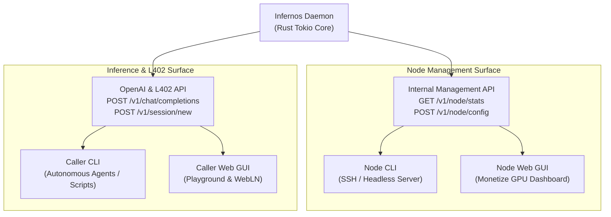

# Infernos GUI Architecture & Core Engine Audit

This document provides a comprehensive architectural blueprint, component specification, and decoupling audit for the Infernos GUI (`gui/`) and its interaction with the core Infernos daemon (`src/`). It serves as an implementation guide for frontend and systems engineers working on Infernos.

---

## 1. System Philosophy: Engine-First & Dual-Client Decoupling

Infernos follows a strict **headless-first, API-centric architecture**. The core Rust daemon (`infernos-node`) is the single source of truth for all business logic, cryptography, payment settlement, and upstream model proxying.

Both the **Command Line Interface (CLI)** and the **Web Graphical User Interface (GUI)** are independent clients consuming the **exact same internal HTTP REST API**.



### Key Architectural Invariants:
1. **Zero Duplicate Logic**: The GUI must **never** implement custom payment validation, macaroon generation, or pricing algorithms. All state lives in the daemon.
2. **Feature Parity**: An operator running headless on an Ubuntu server over SSH via CLI has 100% of the capabilities available in the web GUI.
3. **No Mock Backdoors in Production**: GUI and CLI components communicate with live backends (LND REST, WebLN, or NWC). Mock simulation is isolated strictly to local testing flags.

---

## 2. Directory Tree Structure

All frontend applications reside inside the top-level `gui/` directory, divided into two distinct workspaces:
1. `gui/operator/`: The Node Operator GUI ("Monetize GPU").
2. `gui/client/`: The AI Caller / Agent Playground ("Consume AI").

```text
infernos-ai/
├── src/                                  # Core Rust Daemon & Headless CLI
│   ├── node/api/                         # Axum REST endpoints
│   └── cli/                              # Terminal commands (node, call, status)
│
└── gui/                                  # Frontend Applications
    │
    ├── operator/                         # Node Operator Dashboard
    │   ├── public/
    │   │   ├── favicon.ico
    │   │   └── infernos-logo.svg
    │   ├── src/
    │   │   ├── api/
    │   │   │   └── nodeClient.js         # HTTP client communicating with localhost:8080
    │   │   ├── components/
    │   │   │   ├── EarningsCard.jsx      # Total sats earned, daily ticker, requests served
    │   │   │   ├── ModelList.jsx         # Detected Ollama/vLLM models & pricing toggles
    │   │   │   ├── PricingSettings.jsx   # Base sats/request and sats/token controls
    │   │   │   ├── ChannelHealth.jsx     # LND channel capacity & liquidity bar
    │   │   │   └── LiveSessionTable.jsx  # Active caller sessions and budget debits
    │   │   ├── App.jsx
    │   │   ├── index.css                 # Dark mode, typography, tokens
    │   │   └── main.jsx
    │   ├── index.html
    │   ├── package.json                  # React + Vite workspace
    │   └── vite.config.js
    │
    └── client/                           # AI Consumer / Caller Playground
        ├── public/
        │   ├── favicon.ico
        │   └── infernos-logo.svg
        ├── src/
        │   ├── api/
        │   │   └── l402Client.js         # Handles 402 challenge, WebLN, and completions
        │   ├── components/
        │   │   ├── ChatWindow.jsx        # Conversational UI with streaming tokens
        │   │   ├── WalletBadge.jsx       # WebLN (Alby) & NWC connection status
        │   │   ├── BudgetMeter.jsx       # Real-time satoshi deduction visualizer
        │   │   └── InvoiceModal.jsx      # Fallback QR code & preimage input modal
        │   ├── hooks/
        │   │   ├── useWebLN.js           # WebLN window.webln wrapper
        │   │   └── useChatStream.js      # Server-Sent Events (SSE) token stream reader
        │   ├── App.jsx
        │   ├── index.css
        │   └── main.jsx
        ├── index.html
        ├── package.json
        └── vite.config.js
```

---

## 3. Node Daemon API Specification for GUI & CLI

To enable both the CLI and Operator GUI to display live telemetry, the daemon must expose the following management endpoints on `http://127.0.0.1:8080`:

### 3.1 `GET /v1/node/stats` (Operator Telemetry)
Returns live operational metrics and revenue data.

#### Response (`200 OK`):
```json
{
  "node_id": "02f248695dd71511f32f10ce...",
  "status": "RUNNING",
  "uptime_seconds": 86400,
  "lightning": {
    "backend": "lnd",
    "network": "testnet",
    "channel_count": 2,
    "local_balance_sats": 450000,
    "remote_balance_sats": 150000
  },
  "earnings": {
    "total_sats_earned": 14200,
    "today_sats_earned": 320,
    "total_requests_served": 1420,
    "active_sessions": 3
  },
  "upstream": {
    "engine": "ollama",
    "url": "http://127.0.0.1:11434",
    "status": "CONNECTED",
    "loaded_models": ["llama3.2", "mistral"]
  }
}
```

### 3.2 `GET /v1/node/config` & `POST /v1/node/config` (Live Pricing Updates)
Allows the operator to adjust base price and per-token pricing in real time via the GUI or CLI.

#### Request (`POST /v1/node/config`):
```json
{
  "default_price_sats": 15,
  "sats_per_prompt_token": 0.002,
  "sats_per_completion_token": 0.004
}
```

---

## 4. Frontend Component Breakdown & State Flow

### 4.1 Operator Dashboard (`gui/operator`)
- **`EarningsCard`**: Displays lifetime sats earned, today's sats, and an SVG sparkline showing hourly request volume.
- **`ModelList`**: Fetches active models from `GET /v1/models` and displays inference latency metrics per model.
- **`PricingSettings`**: Live range sliders binding directly to `POST /v1/node/config`.
- **`ChannelHealth`**: Visualizes local vs remote channel capacity to alert the operator if inbound liquidity is low.

### 4.2 Caller Playground (`gui/client`)
- **`ChatWindow`**: Standard markdown-rendering conversational layout with copyable code blocks and latency counters.
- **`WalletBadge`**:
  - Detects `window.webln` (e.g. Alby, Mutiny extension).
  - If WebLN is present: Automatically pays L402 invoices in the background without user prompts.
  - If WebLN is absent: Displays an interactive `InvoiceModal` with a scannable BOLT-11 QR code.
- **`BudgetMeter`**:
  - Visual progress bar showing:
    $$\text{Remaining Budget} = \text{Initial Session Budget} - \sum \text{Turn Costs}$$
  - Turns orange at $<20\%$ and red at $<5\%$, prompting the user to top up the session.

---

## 5. Implementation Roadmap for Frontend Engineers

1. **Step 1: Setup Workspaces**: Initialize `gui/operator` and `gui/client` using `npx vite@latest` with Vanilla CSS and React.
2. **Step 2: API Client Layer**: Implement `nodeClient.js` targeting `/v1/node/stats` and `l402Client.js` with WebLN provider integration.
3. **Step 3: Component Assembly**: Build UI components using curated dark mode color tokens (CSS variables defined in `index.css`).
4. **Step 4: End-to-End Testing**: Test caller playground against a local Infernos node running with Polar or Testnet LND.
