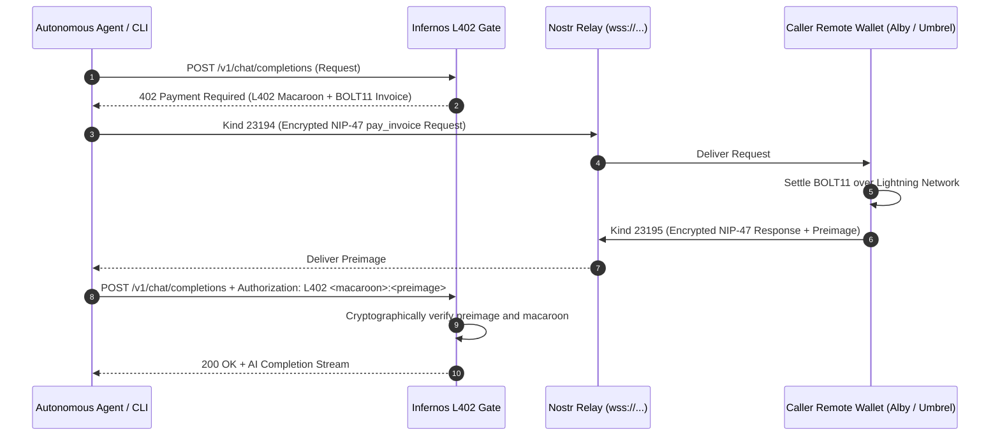

# Nostr & Nostr Wallet Connect (NIP-47) in Infernos

This document explains the role of the Nostr protocol and NIP-47 (Nostr Wallet Connect — NWC) in Infernos, covering architecture, caller automated payments, operator node receiving, and decentralized node discovery.

---

## 1. Why Nostr in Infernos?

Infernos provides permissionless, self-sovereign AI inference paid in satoshis. In production environments, callers (autonomous agents or terminal users) and operators face two primary friction points:

1. **Lightning Infrastructure Burden**: Running a full LND or CLN node requires synchronized chain data, open payment channels, TLS certificates, and macaroon management.
2. **Centralized Discovery**: Finding available inference nodes typically relies on centralized directories or web scrapers.

Nostr solves both challenges:
- **NIP-47 (Nostr Wallet Connect)**: Uses Nostr relays as an end-to-end encrypted messaging pipe between Infernos and remote Lightning wallets (such as Alby Hub, Umbrel, Mutiny, Phoenix, or Voltage).
- **Nostr Relays for Node Discovery**: Allows Infernos nodes to publish cryptographically signed announcements of their available models, pricing, and URLs.

---

## 2. NIP-47 Protocol Architecture



---

## 3. Autonomous Caller / Agent Configuration

Callers can settle L402 challenges completely automatically without manual copy-pasting or holding node secrets on disk.

### Option A: CLI Flag `--payer-nwc-uri`
```bash
infernos call \
  --node http://127.0.0.1:8080 \
  --model llama3.2 \
  --prompt "Explain Bitcoin in one sentence" \
  --payer-nwc-uri "nostr+walletconnect://<wallet-pubkey>?relay=wss%3A%2F%2Frelay.damus.io&secret=<client-secret>"
```

### Option B: Environment Variable `INFERNOS_PAYER_NWC_URI`
For autonomous background agents, configure the environment variable:
```bash
export INFERNOS_PAYER_NWC_URI="nostr+walletconnect://<wallet-pubkey>?relay=wss%3A%2F%2Frelay.damus.io&secret=<client-secret>"
infernos call --model llama3.2 --prompt "Analyze system metrics"
```

When configured, the Infernos CLI banner will output:
```text
Infernos
──────────────────────────────
Node:      http://127.0.0.1:8080
Model:     llama3.2
Budget:    100 sats
Payment:   NWC (Automated)
```

---

## 4. Operator Node Configuration

Operators can configure their Infernos node to receive Lightning payments into any remote NWC-compatible wallet instead of running a local LND instance.

In `config/node.toml`:
```toml
[server]
host = "0.0.0.0"
port = 8080

[lightning]
backend = "nwc"
nwc_uri = "nostr+walletconnect://<wallet-pubkey>?relay=wss%3A%2F%2Frelay.damus.io&secret=<secret>"
```

Or via environment variable:
```bash
export INFERNOS_NWC_URI="nostr+walletconnect://..."
infernos start
```

### Supported NIP-47 Methods:
- `make_invoice`: Generates BOLT11 invoices with custom amounts (in millisatoshis) and descriptions.
- `lookup_invoice`: Verifies payment settlement via payment hash.
- `pay_invoice`: Settles outgoing invoices (used by caller client payment provider).

---

## 5. Security & Privacy Guarantees

1. **End-to-End Encryption (NIP-04 / NIP-44)**: All NIP-47 requests and responses passing through Nostr relays are encrypted using Diffie-Hellman shared secrets. Relay operators cannot read invoices, amounts, or preimages.
2. **Spend Limits & Granular Permissions**: NWC connections can be scoped in the user's wallet with spending allowances (e.g., maximum 500 sats per day), preventing rogue spending.
3. **No Private Keys Exposed**: The Infernos client only holds a temporary connection secret, never the master wallet seed or Lightning private keys.
4. **Zero Prompt Leakage**: Prompts and AI completions are sent strictly over HTTPS directly between caller and node; they are never published to Nostr relays.
