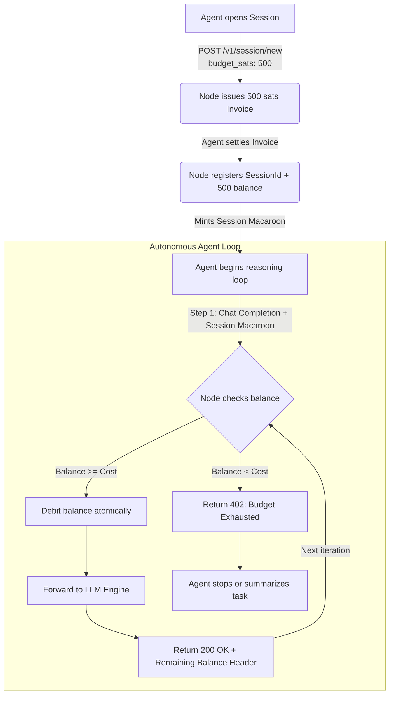

# Session Budgets for Autonomous Agents

Session Budgets solve a critical challenge in autonomous agent computing: **how can an AI agent execute a complex, multi-turn reasoning loop without pausing to settle an individual Lightning invoice on every single tool call or prompt iteration?**

---

## 1. Problem & Motivation

In traditional pay-per-request L402, an agent making 20 sequential LLM calls would need to:
1. Receive 20 HTTP 402 challenges.
2. Pay 20 separate Lightning invoices.
3. Incur network latency and channel routing fees on each hop.

With **Session Budgets**, the caller pre-funds an economic ceiling (e.g., 500 Satoshis) with a **single Lightning payment**. The node enforces this spending limit cryptographically in-memory, deducting sats as tokens are generated.

---

## 2. Session Budget Architecture



---

## 3. Session Lifecycle Flow

### Step 1: Initialize Session
The client opens a session by specifying an initial budget in Satoshis:
```bash
curl -i -X POST http://127.0.0.1:8080/v1/session/new \
  -H "Content-Type: application/json" \
  -d '{"budget_sats": 500}'
```

Response:
```http
HTTP/1.1 402 Payment Required
WWW-Authenticate: L402 token="<macaroon_with_session_caveats>", invoice="<bolt11_for_500_sats>"
Content-Type: application/json

{"error": "Payment required"}
```

The minted macaroon contains:
- `session = <unique_session_uuid>`
- `budget = 500`

### Step 2: Payment Settlement
The caller pays the 500-sat invoice once and receives the payment preimage.

### Step 3: Executing Inferences
On every subsequent inference request, the caller provides the session macaroon and preimage:
```http
POST /v1/chat/completions
Authorization: L402 <session_macaroon>:<preimage>
```

The node's `SessionBudgetManager`:
1. Identifies the session ID from the macaroon caveats.
2. Verifies the preimage matches the invoice.
3. Atomically debits the request cost (e.g. 10 sats) from the remaining balance.
4. Returns the remaining balance in an HTTP response header:
   ```http
   HTTP/1.1 200 OK
   X-Infernos-Remaining-Budget-Sats: 490
   ```

### Step 4: Exhaustion Enforcement
When the session balance is less than the required cost for the next request:
```http
HTTP/1.1 402 Payment Required
Content-Type: application/json

{"error": "Session budget exhausted"}
```
The caller cannot perform further inferences without opening a new session.

---

## 4. Concurrency & Thread-Safety

Infernos uses atomic compare-and-swap (CAS) primitives and thread-safe data structures (`Arc<RwLock<HashMap<SessionId, SessionBudget>>>`) to guarantee:
- **No Overdrafts**: Even if an agent fires 10 concurrent requests, the budget is decremented atomically.
- **Race Condition Immunity**: Requests that would exceed the remaining balance fail immediately before reaching the upstream LLM engine.
- **Clean Memory Management**: Sessions expire after a configurable idle duration.
